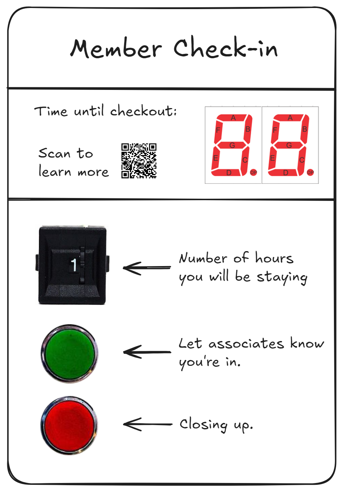

# Project Plan

#### Objectives
The goal of this project is to use existing resources from SplatSpace. Ideally nothing should be purchased for the project, unless it is very specific and completely repurposed (ie. things from scrap-exchange).

## Design

#### Features
- Display remaining time
- Select amount of time to check-in for
- Check-in
- Check all out (everyone has left the space)

#### Panel Layout

*Front panel of the device*
This panel features a QR code which will eventually link to the splat space wiki where guides will exist for its basic usage. On that page should also be some link to this project incase the device is to be modified or repaired.
The controls consist of a thumbwheel switch for duration selection, and buttons for submitting check-in and check-out.
